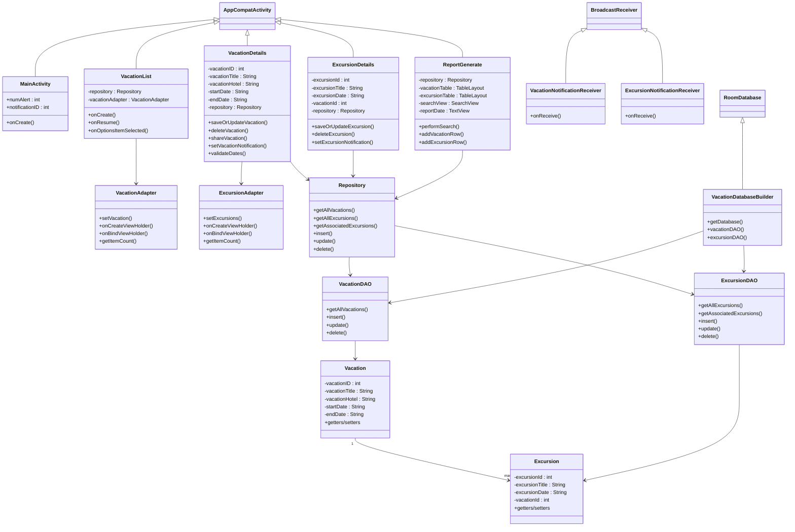

# Vacation Planner Class Diagram

```mermaid
classDiagram

class MainActivity {
+numAlert : int
+notificationID : int
+onCreate()
}

class VacationList {
-repository : Repository
-vacationAdapter : VacationAdapter
+onCreate()
+onResume()
+onOptionsItemSelected()
}

class VacationDetails {
-vacationID : int
-vacationTitle : String
-vacationHotel : String
-startDate : String
-endDate : String
-repository : Repository
+saveOrUpdateVacation()
+deleteVacation()
+shareVacation()
+setVacationNotification()
+validateDates()
}

class ExcursionDetails {
-excursionId : int
-excursionTitle : String
-excursionDate : String
-vacationId : int
-repository : Repository
+saveOrUpdateExcursion()
+deleteExcursion()
+setExcursionNotification()
}

class ReportGenerate {
-repository : Repository
-vacationTable : TableLayout
-excursionTable : TableLayout
-searchView : SearchView
-reportDate : TextView
+performSearch()
+addVacationRow()
+addExcursionRow()
}

class Repository {
+getAllVacations()
+getAllExcursions()
+getAssociatedExcursions()
+insert()
+update()
+delete()
}

class VacationDatabaseBuilder {
+getDatabase()
+vacationDAO()
+excursionDAO()
}

class VacationDAO {
+getAllVacations()
+insert()
+update()
+delete()
}

class ExcursionDAO {
+getAllExcursions()
+getAssociatedExcursions()
+insert()
+update()
+delete()
}

class Vacation {
-vacationID : int
-vacationTitle : String
-vacationHotel : String
-startDate : String
-endDate : String
+getters/setters
}

class Excursion {
-excursionId : int
-excursionTitle : String
-excursionDate : String
-vacationId : int
+getters/setters
}

class VacationAdapter {
+setVacation()
+onCreateViewHolder()
+onBindViewHolder()
+getItemCount()
}

class ExcursionAdapter {
+setExcursions()
+onCreateViewHolder()
+onBindViewHolder()
+getItemCount()
}

class VacationNotificationReceiver {
+onReceive()
}

class ExcursionNotificationReceiver {
+onReceive()
}

AppCompatActivity <|-- MainActivity
AppCompatActivity <|-- VacationList
AppCompatActivity <|-- VacationDetails
AppCompatActivity <|-- ExcursionDetails
AppCompatActivity <|-- ReportGenerate

BroadcastReceiver <|-- VacationNotificationReceiver
BroadcastReceiver <|-- ExcursionNotificationReceiver

RoomDatabase <|-- VacationDatabaseBuilder

VacationList --> VacationAdapter
VacationDetails --> ExcursionAdapter
VacationDetails --> Repository
ExcursionDetails --> Repository
ReportGenerate --> Repository

Repository --> VacationDAO
Repository --> ExcursionDAO
VacationDatabaseBuilder --> VacationDAO
VacationDatabaseBuilder --> ExcursionDAO

VacationDAO --> Vacation
ExcursionDAO --> Excursion

Vacation "1" --> "many" Excursion
```